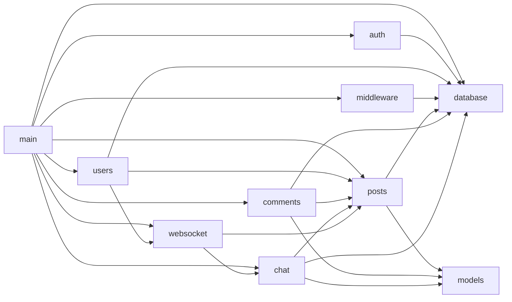
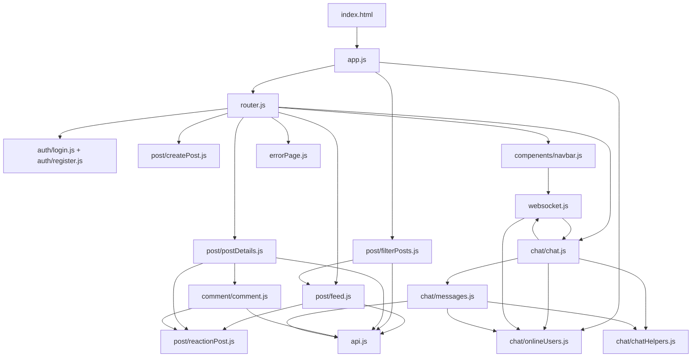
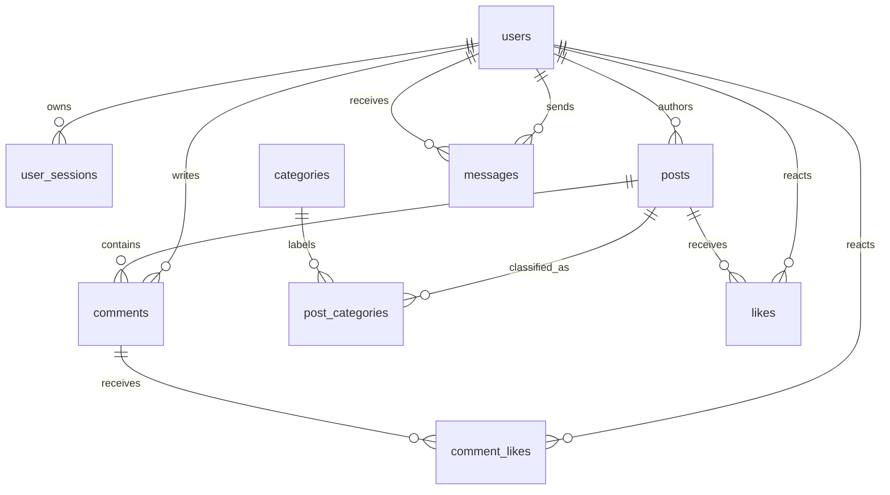
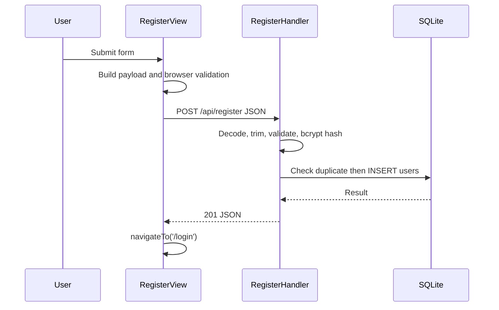
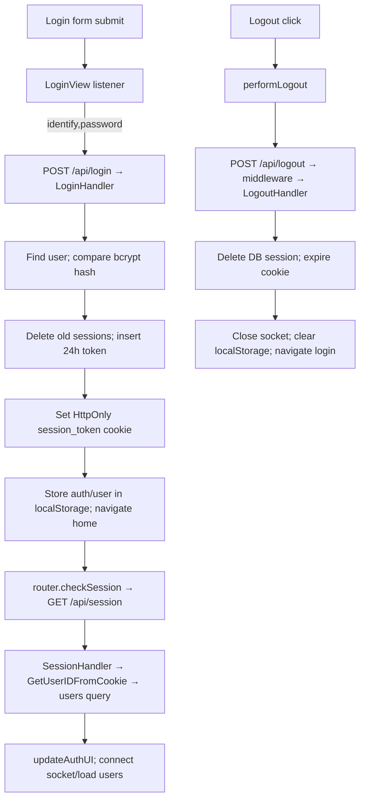
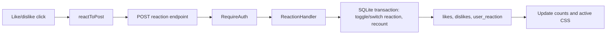
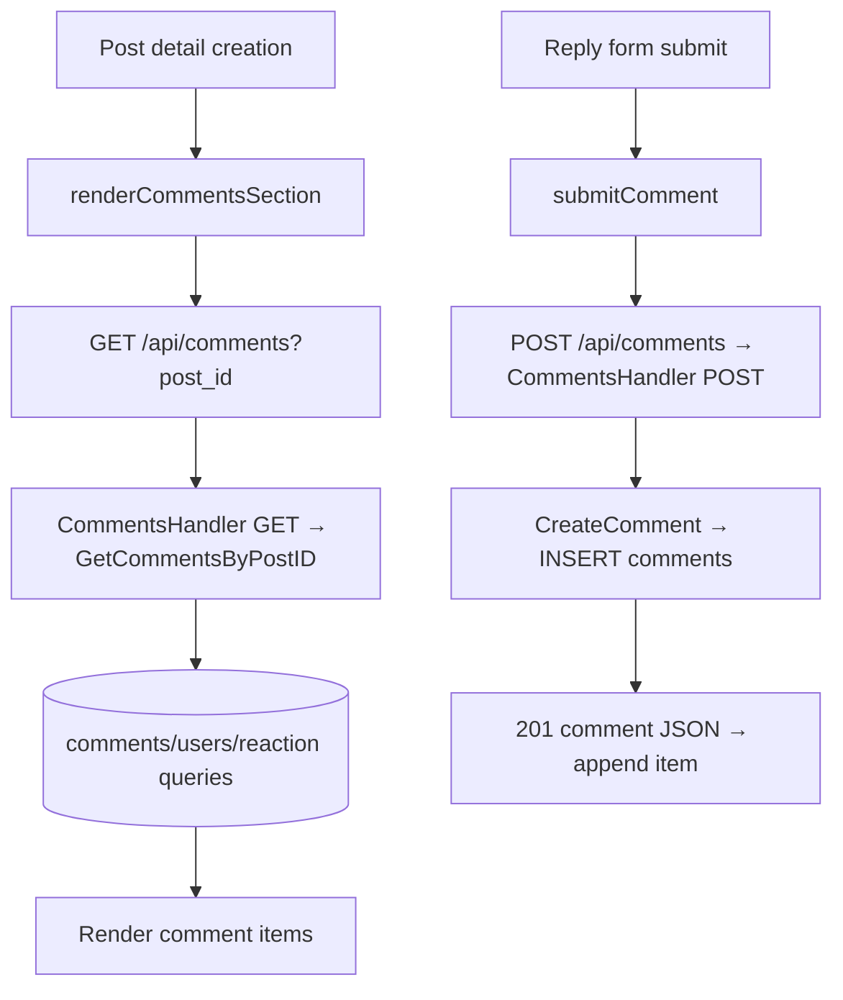
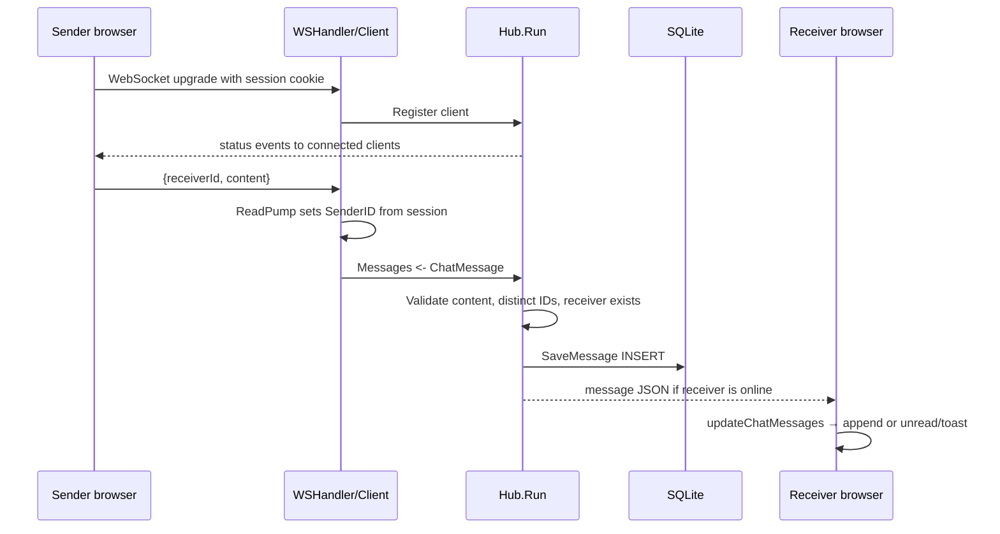

# Real-Time Forum — Source-Based Technical Documentation

## Scope and reading guide

This document describes the implementation present in this repository as inspected on 2026-08-03. The application is a Go server that serves a vanilla-JavaScript single-page application (SPA), stores data in SQLite, and uses a WebSocket hub for private chat and presence.

`main.go` is the backend process entry point. `frontend/index.html` is the browser entry document; its first application code is `frontend/js/app.js`. JavaScript modules create DOM elements and attach event handlers rather than using a frontend framework. CSS files only provide presentation; they do not execute application logic.

> Important accuracy note: there are no routes, handlers, repository functions, UI controls, or schema support for **editing posts**, **deleting posts**, or persistent/general **notifications**. The implemented notification is only an in-browser unread marker and toast for an incoming private-chat message. “Categories” are a fixed six-item list, not a category-management feature.

## Architecture

```mermaid
flowchart LR
  B[Browser: index.html] --> A[app.js / router.js]
  A --> UI[Views and DOM modules]
  UI -->|fetch, JSON, cookies| HTTP[Go net/http server]
  A -->|WebSocket cookie handshake| WS[/ws WebSocket endpoint]
  HTTP --> MW[RequireAuth middleware]
  HTTP --> H[Auth / posts / comments / chat handlers]
  H --> R[Repositories and services]You are a senior software architect, software engineer, and technical writer.

Analyze my project and generate professional documentation using **Markdown** and **Mermaid**.

## General Rules

* Do NOT modify any code.
* Do NOT invent functionality that does not exist.
* Base every explanation strictly on the source code.
* Write everything in clean, professional Markdown.
* Use Mermaid diagrams whenever they improve understanding.
* Explain everything as if teaching a junior developer.
* If the project is too large, analyze it module by module.

---

# For Every Module, File, Class, Function, and Component

For each one, explain:

* What it is.
* Why it exists.
* When it is used.
* Who calls it.
* What it calls.
* What data it receives.
* What data it returns.
* What happens before it executes.
* What happens after it finishes.
* How it interacts with the rest of the project.
* Which files depend on it.
* Which files it depends on.

---

# Explain the Complete Execution Flow

For every feature, explain the execution **from the very beginning until the very end**.

For example:

User Click
↓
JavaScript Event
↓
Function A
↓
Function B
↓
API Request
↓
Backend Router
↓
Handler
↓
Service
↓
Repository
↓
Database
↓
Response
↓
Frontend Update
↓
UI Refresh

For every step explain:

* Why this step happens.
* What data is passed.
* Which function starts the next step.

---

# Show Relationships

Create Mermaid diagrams showing:

* File relationships
* Function call relationships
* Module dependencies
* Import/export relationships
* Data flow
* Request flow
* Response flow
* Database interactions

---

# System Architecture

Create diagrams for:

* Overall architecture
* Frontend architecture
* Backend architecture
* Database architecture
* WebSocket architecture

---

# Feature Workflows

Explain the complete lifecycle for every major feature:

* Registration
* Login
* Logout
* Session validation
* Create Post
* Edit Post
* Delete Post
* Like
* Dislike
* Comments
* Categories
* Filtering
* Private Chat
* Notifications

For each feature show:

Start
↓
Every function executed
↓
Every file involved
↓
Every API/WebSocket call
↓
Database operations
↓
Response
↓
UI update
↓
End

---

# Function Documentation

For every important function include:

* Purpose
* Parameters
* Return value
* Internal logic
* Functions it calls
* Functions that call it
* Side effects
* Possible errors
* Execution order

---

# Database

Generate:

* ER Diagram
* Table explanations
* Relationships
* Query flow

---

# WebSocket

Explain:

Connection
↓
Authentication
↓
Client Registration
↓
Hub
↓
Message Validation
↓
Database Storage
↓
Broadcast/Private Delivery
↓
Frontend Rendering

Create both Flowcharts and Sequence Diagrams.

---

# Final Summary

Finish with a complete "Project Execution Timeline" that shows the project flow from the first user interaction until the final result.

The timeline should clearly answer:

* Where does the execution start?
* Which file runs first?
* Which function runs first?
* What is called next?
* Why is it called?
* What is the last function executed?
* Where does the execution end?

The goal is to understand the complete project execution from beginning to end without reading the source code.

  R --> DB[(forum.db / SQLite)]
  WS --> HUB[Hub + Client pumps]
  HUB --> R
  HUB -->|private messages / presence| B
```

### Startup and ownership

```mermaid
flowchart TD
  M[backend/main.go: main] --> I[database.InitDB('../forum.db')]
  I --> S[Read database/schema.sql and execute it]
  M --> NH[websocket.NewHub]
  NH --> GH[websocket.GlobalHub = hub]
  M --> HR[Register HTTP routes]
  M --> G[go hub.Run]
  M --> L[http.ListenAndServe :8080]
  L --> F[Serve API, /ws, /chat, or frontend files]
```

Before handlers can run, `main` has opened the database, enabled foreign keys, applied the schema, created the hub, and registered routes. On shutdown through normal return, `defer database.DB.Close()` closes the database (although `log.Fatal` exits immediately on startup/server errors).

### Backend module dependencies



### Frontend import/call relationships



## HTTP and WebSocket contract

All `ApiRequest` calls send JSON and `credentials: "include"`, so the browser supplies the `session_token` cookie. Native `fetch` in login/register/logout does not set a credentials option; same-origin cookies are still used by default. Protected backend routes are wrapped in `middleware.RequireAuth`, which verifies an unexpired database session before the handler. Several handlers independently call `posts.GetUserID`, which checks token existence but does **not** recheck expiry; route middleware is what enforces expiration on protected routes.

| Method and endpoint | Protection | Caller(s) | Result |
|---|---|---|---|
| `POST /api/register` | no | `RegisterView` | validates and creates `users` row |
| `POST /api/login` | no | `LoginView` | creates session and `HttpOnly` cookie |
| `GET /api/session` | handler validation | router `checkSession` | current user JSON or 401 |
| `POST /api/logout` | `RequireAuth` | navbar `performLogout` | deletes session and expires cookie |
| `GET, POST /api/posts` | `RequireAuth` | feed/filter/create | list/filter or create post |
| `GET /api/posts/{id}` | `RequireAuth` | `loadPostCard` | one enriched post |
| `POST /api/reaction` | `RequireAuth` | `reactToPost` | post reaction totals/state |
| `GET, POST /api/comments` | `RequireAuth` | comment module | list or create comments |
| `POST /api/comments/reaction` | `RequireAuth` | `reactToPost` | comment reaction totals/state |
| `GET /api/users` | `RequireAuth` | `loadUsers` | other users, last chat activity, online state |
| `GET /chat` | no route wrapper; handler checks token | `loadMessages`, `loadMoreMessages` | paged conversation history |
| `GET /ws` | handler checks token | `connectWebSocket` | upgraded authenticated socket |

## Database design and query flow



| Table | Purpose and important fields |
|---|---|
| `users` | Account identity. Unique `username` and `email`; bcrypt hash in `password`; profile fields are optional at database level. |
| `user_sessions` | Token-to-user mapping with `expires_at`; login deletes prior sessions for the user before inserting one. |
| `posts` | Author, title, content, creation time. |
| `categories` | Fixed seed values: General, Technology, Programming, Gaming, Science, Education. |
| `post_categories` | Many-to-many post/category links. It has foreign keys but no declared composite uniqueness constraint. |
| `comments` | A comment belongs to one post and author. |
| `likes`, `comment_likes` | One reaction per user/item enforced with `UNIQUE(user_id, post_id)` or `UNIQUE(user_id, comment_id)`; `1` means like and `0` means dislike. |
| `messages` | Directed private message with sender, receiver, content, and database timestamp. |

`database.InitDB` reads and executes `database/schema.sql` on each server start using `CREATE TABLE IF NOT EXISTS` and `INSERT OR IGNORE` for categories. Query ownership is deliberately close to each feature: auth/session queries are in their handlers; posts/comments/chat retrieval and persistence are in their repository files; reaction handlers contain their own transactions.

## Backend file and function reference

### `backend/main.go`

**What/why:** Application composition root. It imports every feature package because it creates shared infrastructure and maps URL/method patterns to handlers. No application file calls `main`; the Go runtime calls it. It receives no parameters and does not return. It calls database initialization, hub construction, `hub.Run` in a goroutine, `http.HandleFunc`, `http.FileServer`, and `http.ListenAndServe`.

The final request fallback checks whether `../frontend` plus the request path exists. If not, it replaces the path with `/` before serving static content, allowing SPA URLs to load `index.html`.

### `backend/database/sqlite.go` and `schema.sql`

`DB` is a package-global `*sql.DB` depended on by every database-using package. `InitDB(dbPath string) error` is called only by `main`; it opens SQLite, enables foreign keys, reads `schema.sql` relative to the backend working directory, executes it, and returns errors. `schema.sql` is declarative, not Go code; it defines the tables above and seeds categories.

### Models — `backend/internal/models/models.go`

`User`, `Post`, `Comment`, and `Message` are data carriers shared by posts/comments/chat. Their JSON tags define API field names for the fields exposed to JavaScript. `Post` and `Comment` add derived query data such as author nickname, counts, and current viewer reaction; these values do not all correspond to stored columns. The file has no functions or database calls.

### Authentication — `backend/internal/auth/`

| Function/type | Purpose, inputs, calls, output and effects |
|---|---|
| `RegisterRequest` | JSON request shape received by `RegisterHandler`: username, profile details, email, plain password. |
| `APIResponse` | Shared `{status, message}` JSON response used by all auth handlers. |
| `RegisterHandler(w,r)` | Called by `POST /api/register`. Decodes `RegisterRequest`; trims non-password strings; validates username, age, gender, names, email, and password rules; queries `users` to avoid duplicate identity; bcrypt-hashes the password; inserts `users`; returns `201` success or a specific 400/409/500 JSON error. Its only persistent side effect is a new user row. |
| `LoginRequest` | Input `{identify, password}`; `identify` can be email or username. |
| `generateSessionToken() string` | Private helper called only by `LoginHandler`. Reads 32 cryptographic-random bytes and Base64URL encodes them; logs and returns empty string if random generation fails. |
| `LoginHandler(w,r)` | Called by `POST /api/login`. Decodes request, queries user by email/username, calls `bcrypt.CompareHashAndPassword`, deletes existing sessions, creates a token/expires-at time, inserts `user_sessions`, sets `session_token` (`HttpOnly`, `/`, 24h), and returns user id/username/nickname. Errors stop later steps and return 400, 401, or 500. |
| `LogoutHandler(w,r)` | Reached through protected `POST /api/logout`. It reads the cookie if present, deletes that session token, then always sends an immediately-expired `HttpOnly` cookie and a success JSON result. Database deletion errors are logged but do not change the response. |

### Sessions/users — `backend/internal/users/`

| Function/type | Purpose, inputs, calls, output and effects |
|---|---|
| `GetUserIDFromCookie(r) (int,error)` | Used only by `SessionHandler`. Reads `session_token`, queries `user_sessions` for user/expiry, rejects missing/invalid/expired sessions, otherwise returns the ID. |
| `SessionHandler(w,r)` | `GET /api/session` entry point. Calls `GetUserIDFromCookie`, then queries `users` for profile data. Returns `{status, user}` or 401; it does not modify state. |
| `PublicUser` | `/api/users` response row: identity/nickname, WebSocket-derived `Online`, and `Lastmessage`. |
| `UsersHandler(w,r)` | Protected `GET /api/users` handler. Calls `posts.GetUserID`; executes the file-level SQL query to list all other users ordered by latest message; parses SQLite aggregate timestamps; calls `websocket.GlobalHub.IsOnline` for each row; returns a JSON array, including `[]` rather than `null`. |

### Middleware — `backend/internal/middleware/`

`RequireAuth(next http.HandlerFunc) http.HandlerFunc` is called while `main` registers protected routes. At request time it verifies a nonempty cookie and `user_sessions.expires_at > time.Now()`. Before the wrapped handler executes it adds `userID` to request context (current handlers do not read that value) and calls `next.ServeHTTP`. Invalid cases call private `clearCookie` and `sendJSONError`, returning 401. `clearCookie` expires the browser cookie; `sendJSONError` writes standard JSON error data.

### Posts — `backend/internal/posts/`

| Function/type | Purpose, inputs, calls, output and effects |
|---|---|
| `PostHandler(w,r)` | Route entry for `GET/POST /api/posts`. POST: calls `GetUserID`, decodes `models.Post`, calls `ValidatePostInput`, sets server user/time, calls `CreatePost`, returns 201 JSON. GET: reads optional `category`, calls `GetAllPosts(category,userID)`, and returns enriched posts. |
| `GetPostHandler(w,r)` | `GET /api/posts/{id}` entry. Parses `r.PathValue("id")`, obtains viewer ID, calls `GetPostByID`, returns one post or 400/404. |
| `ValidatePostInput(post) bool` | Called by `PostHandler`. Requires trimmed title 1–150, one or more categories from fixed `categories`, and trimmed content 1–4500. |
| `checkCategories(allowed,selected) bool` | Private validator used by `ValidatePostInput`; every selected string must be one of the six exact values. |
| `GetUserID(r) (int,error)` | Shared by posts, comments, chat, websocket, and users. Looks up `user_sessions.user_id` by cookie. On protected routes it runs after middleware; `/chat` and `/ws` rely on it directly. |
| `CreatePost(post) error` | Repository write called by `PostHandler`. Inserts `posts`, obtains generated ID, looks up each requested category ID, and inserts `post_categories` links. It returns wrapped errors; the caller converts them to HTTP 500. |
| `GetAllPosts(category,userID)` | Repository read called by GET handler. Builds `postSelectSQL`; `liked` selects the viewer's liked posts, a normal category filters via link table, blank/`all` has no filter. It scans and returns descending creation-time posts. |
| `GetPostByID(postID,userID)` | Calls the shared select and `scanPost` for one ID. |
| `scanPost(scanner)` / `parseCategories(*string)` | Private mapping helpers. `scanPost` collects joined categories, counts and optional viewer reaction into `models.Post`; `parseCategories` converts SQLite `group_concat` to `[]string`. |
| `ReactionRequest` | JSON body `{post_id,is_like}`; is_like must be 1/0. |
| `ReactionHandler(w,r)` | Protected `POST /api/reaction`. Validates caller/body/type/post existence; begins a transaction; deletes a matching reaction to toggle it off or deletes/reinserts to set/switch it; recounts likes/dislikes; commits; returns counts plus `user_reaction` (`-1`, 0, or 1). Rollback is deferred if the transaction is not committed. |

### Comments — `backend/internal/comments/`

| Function/type | Purpose, inputs, calls, output and effects |
|---|---|
| `CommentsHandler(w,r)` | `GET/POST /api/comments` entry. GET parses `post_id`, gets viewer ID, calls `GetCommentsByPostID`, returns comments. POST gets user ID, decodes `models.Comment`, requires positive post id/nonblank content, looks up author username, sets author/time, calls `CreateComment`, returns 201. |
| `CreateComment(comment) (models.Comment,error)` | Inserts `comments`, reads `LastInsertId`, fills `comment.ID`, and returns the complete server-side model. |
| `GetCommentsByPostID(postID,userID)` | Joins comments/users and subqueries reaction totals/current viewer reaction. It scans ascending-time results, assigns `Nickname`, and returns the slice. |
| `ReactionRequest` / `ReactionHandler` | Comment analogue of post reactions: JSON `{comment_id,is_like}`, validates target, transactionally toggles/switches `comment_likes`, recounts, and returns JSON totals/state. It calls `posts.GetUserID`. |

### Chat and WebSocket — `backend/internal/chat/` and `websocket/`

| Function/type | Purpose, inputs, calls, output and effects |
|---|---|
| `ChatHandler(w,r)` | `GET /chat` history entry. Requires GET, calls `posts.GetUserID`, parses integer `receiver`, `limit`, and `offset`, calls `GetMessages`, and JSON-encodes latest-first history. It has no `RequireAuth` wrapper but does perform token lookup. |
| `SaveMessage(sender,receiver,content) error` | Called by `Hub.Run` after validation; inserts one `messages` row. |
| `GetMessages(user,other,limit,offset)` | Called by `ChatHandler`; selects both sender/receiver directions ordered `created_at DESC`, applies pagination, scans `models.Message`. |
| `UserExists(id)` | Hub helper that returns whether a receiver user row exists. |
| `Checkmessage(text) bool` | Hub validation: trimmed message must be 1–1000 characters. |
| `ChatMessage` | WebSocket JSON envelope. `status` uses `userId/online`; `message` uses sender/receiver/content/createdAt. |
| `Client` | One WebSocket connection: authenticated user, hub pointer, Gorilla connection, buffered outbound `Send` channel. |
| `WSHandler(hub)` | Route factory called by `main`; returned function authenticates via `posts.GetUserID`, upgrades HTTP, builds `Client`, sends it to `Register`, and starts `ReadPump`/`WritePump` goroutines. |
| `Client.ReadPump()` | Runs per connection. Repeatedly reads JSON to `ChatMessage`, overrides forged `SenderID` with authenticated ID, sends it to `Hub.Messages`; on failure unregisters and closes. |
| `Client.WritePump()` | Runs per connection. Takes bytes from `Send`, writes WebSocket text frames; exits/closes on channel or write error. |
| `NewHub() *Hub` | Called once by `main`; initializes client map/channels and writes package-global `GlobalHub` for presence queries. |
| `Hub.IsOnline(id)` | Used by `UsersHandler`; read-locks the map and reports whether the user has at least one active connection. |
| `Hub.broadcastStatus(id,online)` | Private helper called after first connection/last disconnection; marshals a status `ChatMessage` and queues it to all clients. |
| `Hub.Run()` | Long-running event loop launched by `main`. It registers clients (and broadcasts first-online), validates/persists/routes messages, and unregisters clients (broadcasting last-offline). It is the only coordinator of hub channels. |

## Frontend file and function reference

### Shell and common modules

| File | What it is, callers/dependencies, and behavior |
|---|---|
| `index.html` | Static page shell served by Go. It provides sidebar, navbar, `#app`, chat sidebar, modal markup, category buttons, stylesheet links, and module entry `app.js`. Inline HTML handlers call globals installed by modules: `navigateTo`, `filterByCategory`, chat controls. |
| `js/app.js` | Browser JS entry. Imports filter/router/online-users for module initialization; on desktop attaches cursor-glow mouse handler; exposes `filterByCategory`; calls `initRouter()`. |
| `js/api.js` | `ApiRequest(url,options)` is called by post/comment/chat modules. It JSON-serializes an optional body, includes cookies, throws on non-2xx, and returns parsed JSON. |
| `js/errorPage.js` | `ErrorPageView(status)` builds `{dom,logic}` with a home button; `renderError` immediately replaces `#app`. Router uses the view factory; nothing in this code calls `renderError`. |
| `js/router.js` | SPA coordinator. `initRouter` handles browser history, intercepts internal links, and renders initial URL. `navigateTo` pushes history then calls private `render`. `render` calls private `checkSession`, applies guards/layout visibility, invokes navbar update, then creates a route view or loads a post detail. `checkSession` calls `/api/session`, synchronizes `localStorage` auth/currentUser and navbar, with a network fallback to cached auth. |
| `js/compenents/navbar.js` | `updateAuthUI` renders auth/user/logout controls and calls global `initOnlineSocket` when authenticated. `performLogout` posts `/api/logout`, closes socket, clears local storage, and navigates login. `initNavbar` attaches mobile sidebar controls and storage synchronization; module code runs it at/after DOM ready. Directory spelling is `compenents` in source. |
| CSS files | `layout.css`, `feed.css`, `create-post.css`, `auth.css`, `comments.css`, `chat.css`, and `errorPage.css` style corresponding static/dynamic elements. `base.css` exists but is not linked by `index.html`, so it is not loaded by this page as written. |

### Authentication views

`auth/login.js` exports `LoginView()`, called by the router for `/login`. It returns form DOM and `logic`; the submit listener sends `{identify,password}` to `/api/login`, displays backend errors, stores success user/auth flags, and calls `navigateTo('/')`.

`auth/register.js` exports `RegisterView()`, called for `/register`. Its listener builds profile JSON, sends it to `/api/register`, displays errors, and navigates to `/login` after a successful 201. Browser `required`, min/max fields are a first validation layer; backend performs authoritative validation.

### Posts, filtering, and reactions

| Function/file | Execution role |
|---|---|
| `feed.renderHomeFeed(container)` | Router home view builder; supplies `#feed-container`. |
| `feed.loadFeed()` | Called after home rendering. Marks “all” active, calls `ApiRequest('/api/posts')`, then calls `renderPosts` or `showEmpty`; errors replace feed text. |
| `feed.renderPosts(posts)` / private `createPostCard` | Creates clickable cards with textContent and reaction UI. A card click calls `navigateTo('/post/{id}')`; reaction handlers stop propagation. Private `formatDate` formats `created_at`. |
| `feed.showEmpty(category)` | Builds no-post state; for non-liked results its button navigates create-post. |
| `filterPosts.filterByCategory(category)` | Exposed globally by `app.js`, called by sidebar buttons. Changes active state, calls `/api/posts` with optional encoded category, defensively re-filters liked responses by `user_reaction`, then renders or shows empty. |
| `createPost.CreatePostView()` / private `createPostForm` | Router `/create-post` view and form factory. Form submit calls `handleCreatePost`. Private `createCategorySection` creates the same fixed six choices. |
| private `handleCreatePost(event)` | Client-validates title/categories/content; `ApiRequest` POSTs `{title,content,categories}` to `/api/posts`; navigates home after success. `showPostError` writes errors. |
| `postDetails.loadPostCard(id)` | Router invokes it for `/post/:id`. Fetches one post then appends private `createPostDetails`; on failure dynamically imports error view. Details calls `renderCommentsSection`. Private `createBackButton` returns home. |
| `reactionPost.createReaction(...)` | Called by feed, detail, and comment renderers. Builds like/dislike controls and their listeners. Note feed/detail calls omit `initialUserReaction`, so their initial button active state is not set even though backend provides it; later response updates it. |
| private `reactToPost(...)` | Disables pair, picks post/comment endpoint/body based on `itemType`, performs API call, updates matching counts/classes across DOM, handles unauthorized navigation, then reenables. |

### Comments

`comment.js` exports `fetchComments(postId)` and `submitComment(postId,content)` thin API functions. `renderCommentsSection(postId,container)` is called by the post-detail renderer: it fetches comments (treating failure as empty), creates a list/form, renders each with private `createCommentItem`, and attaches submit logic. The listener validates 1–4500 characters, submits, then appends the returned comment (or a local fallback); it displays errors and redirects on an authorization error. `escapeHTML` is exported but unused; rendering actually uses `textContent`, which avoids interpreting comment content as HTML.

### Chat, presence, and in-browser message notification

| Function/file | Execution role |
|---|---|
| `websocket.connectWebSocket` / `initOnlineSocket` | Navbar calls global initializer after session confirmation. It avoids duplicate open/connecting sockets, opens `ws://localhost:8080/ws`, installs event callbacks, and loads user list. `closeWebSocket` closes only an open socket. |
| `websocket.sendWebSocketMessage` / private `handleWebSocketMessage` | Chat calls sender with receiver/content; it sends only if open. Incoming parsed `status` calls `updateOnlineUsers`; incoming `message` calls `updateChatMessages`. |
| `onlineUsers.loadUsers` | Fetches `/api/users`, caches and sorts rows, then private `renderUsers` creates selectable member rows. `getUserById` reads cache. |
| `onlineUsers.updateOnlineUsers`, `reorderUsers` | WebSocket callbacks update status CSS or move a sender to top/preview it. |
| `onlineUsers.showNotification`, `markRead` | In-memory `Set` plus CSS unread indicator; this is not a persisted notification system. Private helpers determine timestamp/existence and format relative time. |
| `chat.ChatView` | `/messages` router view; its `logic` opens sidebar/users. |
| `chat.toggleChatSidebar`, `openChatSidebar`, `switchChatView` | Globals used by HTML; show/hide sidebar and users/conversation panes, then load users as needed. |
| `chat.openChat` | Global called by a member row/toast. Sets `window.currentChatUser`, marks UI active/read, resets history state, calls `loadMessages`, focuses input. |
| `chat.sendMessage` | Form listener installed at module load. Validates input, sends socket message, optimistically appends a local outgoing bubble and reorders list; it does not wait for database confirmation. |
| `chat.updateChatMessages` | Socket delivery entry. Reorders user list; if sender is active it queues/appends and scrolls; otherwise it marks unread and creates clickable toast that opens chat. |
| `messages.loadMessages` | Called when opening conversation. Calls paged `/chat`, rejects stale result after user switch, reverses latest-first server records for rendering, handles pending live message/empty/error, scrolls. |
| `messages.loadMoreMessages` | Throttled scroll listener calls it near top. It requests next page, prepends older DOM, preserves viewport and pagination. |
| `messages.resetMessages`, `renderMessages`, `appendMessage`, `senderNickname`, `removeEmptyMessage`, `queueLiveMessage` | State/DOM helpers used by chat. `appendMessage` uses local storage to label own messages and only `textContent` for message content. |
| `chatHelpers` | `autoScroll`, `isNearBottom`, `formatMessageTime`, `showMessageToast`, and `addThrottledScrollListener` are presentation/event helpers used by chat/messages. |

## Implemented feature workflows

### Registration



The initial browser handler is installed by `RegisterView.logic`. The backend is responsible for all security-relevant validation and password hashing. The flow ends at the login route; registration does not create a session.

### Login, session validation, and logout



`checkSession` runs before every routed page render, which is why it happens after successful navigation as well as browser load/back navigation. Protected API routes additionally validate the cookie server-side; client local storage alone cannot authorize backend calls.

### Create, list, filter, and view posts

```mermaid
flowchart TD
  CP[Create form submit] --> HC[handleCreatePost]
  HC --> AP[ApiRequest POST /api/posts]
  AP --> MW[RequireAuth]
  MW --> PH[PostHandler POST]
  PH --> V[ValidatePostInput]
  V --> CR[CreatePost]
  CR --> DB1[(INSERT posts; lookup/link categories)]
  DB1 --> RES[201 post JSON]
  RES --> HOME[navigateTo('/')]
  HOME --> LF[loadFeed → GET /api/posts]
  LF --> GH[PostHandler GET → GetAllPosts → SQLite joins/counts]
  GH --> RP[renderPosts]
```

Filtering begins when an HTML category button calls global `filterByCategory`. It requests `GET /api/posts?category=...`; server `GetAllPosts` uses the category or special `liked` query. Clicking a card starts router post-id handling: `loadPostCard` requests `/api/posts/{id}`, renders its details, then starts the comments flow.

### Post/comment reactions



The same frontend function handles both item types by changing endpoint, body key, selectors, and `data-*` attribute. The two Go handlers use parallel transaction logic but separate tables (`likes` and `comment_likes`).

### Comments



Before a create, both browser and handler reject blank content; the frontend also limits it to 4,500 characters. The server fills author name and timestamp before storing it. There is no comment edit/delete workflow.

### Private chat, presence, and message delivery



Connection starts when `updateAuthUI` calls `window.initOnlineSocket` after authenticated render. `WSHandler` authenticates **before** Gorilla upgrades, then `Hub.Run` records the connection. A sender’s browser appends an optimistic bubble immediately; the server sends the persisted message only to receiver connections, not back to sender. If the receiver is offline, storage still succeeds but no live delivery occurs. Later `openChat → loadMessages → GET /chat → GetMessages` retrieves conversation history from SQLite. The current chat UI displays unread indicators/toasts only in memory; refresh clears them.

## Requested features not implemented

| Requested item | Source evidence |
|---|---|
| Edit Post | No `PUT`/`PATCH` post route, update SQL, or edit UI function. |
| Delete Post | No `DELETE` post route, deletion SQL, or UI function. |
| Persistent notifications | No `notifications` table, API, hub message type, or persistence. Only `showNotification`/`showMessageToast` client behavior exists for chat. |
| Category administration | Categories are schema-seeded and client/server constant lists; no category CRUD API/UI. |

## Project execution timeline

1. **Server starts:** Go runtime calls `backend/main.go:main`. It initializes SQLite schema, creates/runs the WebSocket hub, registers routes, then blocks in `http.ListenAndServe`.
2. **Browser loads:** static fallback serves `frontend/index.html`; browser loads styles and runs `frontend/js/app.js` as its first application module.
3. **SPA boot:** `app.js` calls `initRouter`; router calls private `render(current pathname)`.
4. **First authorization decision:** `render` calls `checkSession`, which starts with `GET /api/session`; `SessionHandler` and `GetUserIDFromCookie` verify a real, unexpired session. No session redirects a protected route to `/login`; a valid session stores current user, updates UI, and opens/maintains WebSocket presence.
5. **User interaction:** an event listener or inline handler starts the relevant feature function—for example `loadFeed`, form submit listener, `filterByCategory`, `reactToPost`, `openChat`, or `sendMessage`.
6. **Server execution:** API interaction reaches the exact route in `main`; protected routes execute `RequireAuth`, then handler, validation/service/repository and SQLite as appropriate. WebSocket messages instead enter `Client.ReadPump` and `Hub.Run`.
7. **Result:** handlers encode JSON or hub queues a WebSocket frame. `ApiRequest`/native fetch resolves and the originating JS function updates DOM, navigation, local state, or UI classes. For database-backed chat history, the last server function is `GetMessages`; for live delivery it is `Client.WritePump` writing the receiver frame. For normal HTTP features, the final server action is JSON encoding/writing the response, followed by the frontend render/update that ends the interaction.

This is event-driven software rather than one single linear request: after startup the server and hub continue waiting for the next HTTP request, WebSocket frame, browser navigation, or DOM event.
